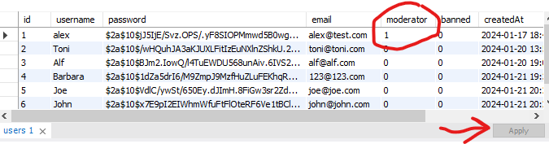

# CampusConnect

To get the application correctly set up you need to follow some steps:

- choose an IDE or code editor of your liking (we recommend Visual Studio Code) and
   - clone the repository: https://github.com/AM2552/CampusConnect.git

In this repository you will find 2 main structures:

    client & server

The client structure will act as the application's frontend and the server structure as the backend.

We recommend opening two terminal instances for easier setup of the components.

**Setup for client application**:

In the terminal type:

- cd ./client
- npm install react, formik, yup, axios
- npm start

**Setup for backend application**:

- cd ./server
- npm install --save-dev nodemon
- npm install express, multer, bcryptjs, cors, mysql2, sequelize, sequelize-cli, jsonwebtoken

Then important, 
- npx sequelize init

and delete folders seeders and migrations if there.

For sequelize:

- don't touch the index.js file, this just identifies the files in /server/models as different tables
- to connect to your database with the mysql workbench go to /server/config/config.json, change the properties to the ones you set on mysql (if you used different ones)

You will need to set up a local database:

- download mysql server, workbench and shell on your pc
  - follow the guide here -> https://www.youtube.com/watch?v=k5tICunelSU&t=303s
  - **IMPORTANT:** during the setup you will set a root password, if you choose "admin" you wont need to change it afterwards as it is used in the config file.
  Also make sure to choose the database name "campusconnect".

In the terminal for ther server type

- npm run dev

and wait for initialization.

Once the client runs via "npm start" and the server via "npm run dev" you can navigate to the application by opening a browser and typing "localhost:3000" in the address line.

**If you want to test Moderator functionality:**
- Create a user by registering in the application
- Open you MySQL Workbench and login to the localhost instance with the root password

    

- Head to "schemas" and select the table "users", right click and select "Select Rows - Limit 1000"
    

- Then in the users table select your user and changed the value of the moderator attribute to 1. Afterwards hit "Apply" and confirm the prompting.
    

Now you can log in with this user and enjoy the moderator benefits.

**Basic usage of CampusConnect:**

1. Pressing the HomePage button will always navigate you back to this screen.

2. File Upload space: choose a file that you want to share and press "Upload" (accepted filetypes: jpeg|jpg|png|gif|pdf|doc|docx)

3. Press "Get all files" to see a list of all files currently available.
You can download files from others and choose to delete you files again. Moderators can delete all files.

4. Sorting and filtering: YOu can sort the threads by creation date or by alphabet and filter them by users or keywords.

5. A basic thread. Clicking on it will enter the thread and you can start adding posts to discuss the topic. You can edit or delete your own posts. Moderators can delete posts from others, as well as delete, close or archive the thread.

6. Logout button that will take you back to the Login page.

7. Create Thread button that lets you create a new thread.

8. In moderator mode: underneath the "Create Thread" button you will have the option to ban or unban other users from the application.
